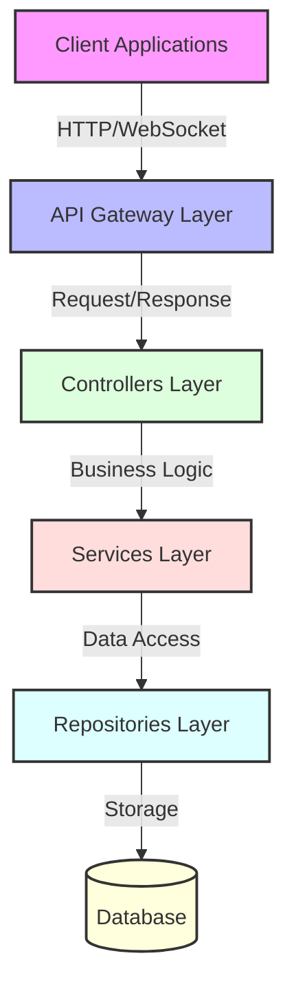
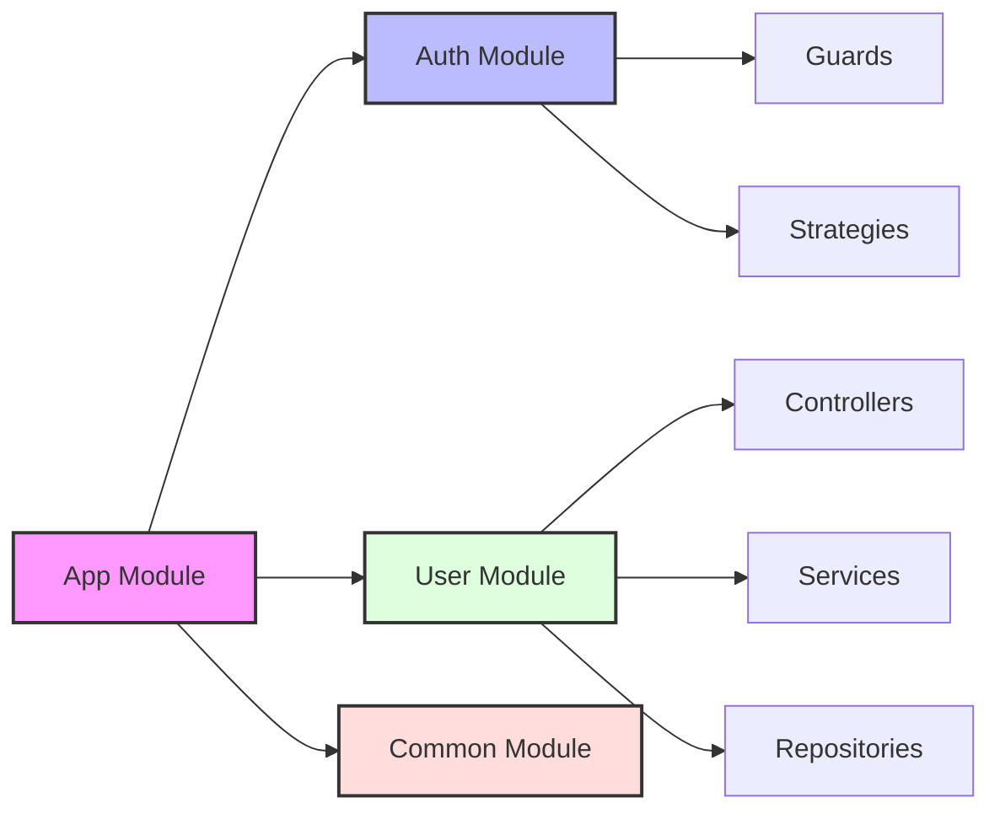
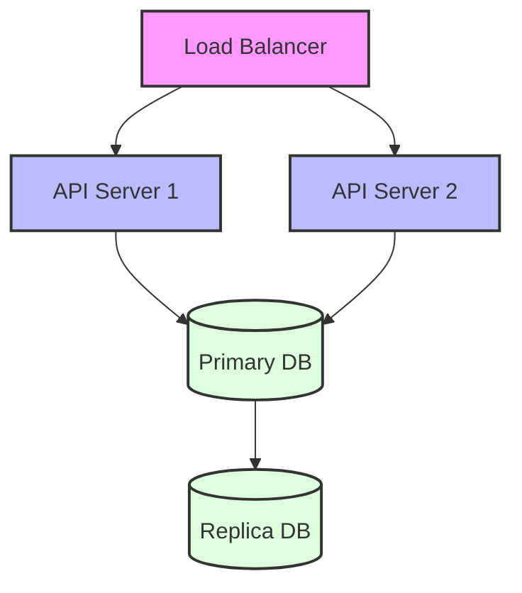

# System Architecture

## Overview
This document describes the high-level architecture of our NestJS-based application. The system follows a modular, layered architecture pattern that promotes separation of concerns and maintainability.

## Architectural Layers

### 1. API Gateway Layer
- Handles incoming HTTP requests and WebSocket connections
- Manages request validation and authentication
- Routes requests to appropriate controllers
- Implements API versioning and documentation (Swagger)

### 2. Controllers Layer
- Processes incoming requests
- Validates input data
- Coordinates with services for business logic
- Formats responses
- Handles error responses

### 3. Services Layer
- Implements core business logic
- Manages transactions and data consistency
- Coordinates between different modules
- Handles complex operations and workflows
- Implements business rules and validations

### 4. Repositories Layer
- Manages data access operations
- Implements database queries and operations
- Handles data mapping and transformations
- Provides data persistence abstraction

### 5. Database Layer
- Stores application data
- Manages data relationships
- Handles data integrity

## Key Design Patterns

1. **Dependency Injection**
   - NestJS's built-in DI container manages dependencies
   - Promotes loose coupling and testability
   - Facilitates modular design

2. **Repository Pattern**
   - Abstracts data persistence operations
   - Separates business logic from data access
   - Enables easier testing and maintenance

3. **DTO Pattern**
   - Defines data transfer objects for API requests/responses
   - Ensures type safety and validation
   - Documents API contracts

4. **Decorator Pattern**
   - Implements cross-cutting concerns
   - Manages authentication and authorization
   - Handles request/response transformations

## Module Organization

## Security Architecture

1. **Authentication**
   - JWT-based authentication
   - OAuth2 support (if implemented)
   - Session management

2. **Authorization**
   - Role-based access control (RBAC)
   - Permission-based guards
   - Resource ownership validation

3. **Data Protection**
   - Input validation
   - SQL injection prevention
   - XSS protection
   - CSRF protection

## Error Handling

- Global exception filter
- Custom exception classes
- Structured error responses
- Logging and monitoring

## Monitoring and Logging

- Built-in logging system
- Performance metrics
- Health checks
- Error tracking

## Testing Strategy

1. **Unit Tests**
   - Service layer testing
   - Controller testing
   - Repository testing

2. **Integration Tests**
   - API endpoint testing
   - Database integration
   - External service integration

3. **E2E Tests**
   - Full application flow testing
   - User scenario testing

## Deployment Architecture

## Performance Considerations

1. **Caching Strategy**
   - Response caching
   - Database query caching
   - In-memory caching

2. **Database Optimization**
   - Index optimization
   - Query optimization
   - Connection pooling

3. **API Performance**
   - Response compression
   - Rate limiting
   - Pagination 